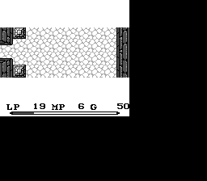

# Mystic Quest Recomp

A from-scratch, native reimplementation of **Mystic Quest** — the European
Game Boy release of *Final Fantasy Adventure* (US) / *Seiken Densetsu:
Final Fantasy Gaiden* (JP), the first entry in Square's *Mana* series —
built in Lua on top of [LÖVE2D](https://love2d.org/).

This is **not** a decompilation and it does not ship any part of the
original game. Every mechanic, table, and format documented or reproduced
here was derived by reverse-engineering a user-supplied ROM dump at
runtime, then written up with an explicit evidence trail (real
disassembly, live emulator traces, cross-checks) before being ported to
Lua. See [**"How this project works"**](#how-this-project-works) below
for the discipline behind that claim.



<sub>Screenshot of this project's own renderer, decoding graphics live
from a user-supplied ROM. *Mystic Quest*/*Final Fantasy Adventure* is
© Square (Square Enix) — see [Legal notice](#legal-notice).</sub>

## Legal notice

**This repository contains no copyrighted game assets.** No ROM, no
extracted graphics, no music, no game text is committed here (see
[`.gitignore`](.gitignore) — `*.gb`, `*.gbc`, `baseroms/`,
`data/generated/`, `assets/generated/` are all excluded). Running this
project requires **your own, legally-obtained ROM dump** of *Mystic
Quest* (EU); everything the app renders or plays is decoded from that
file at load time, never bundled.

`docs/` documents ROM addresses, table layouts, and byte formats — the
same kind of information published for countless games on sites like
Data Crystal or TCRF — not the copyrighted content itself. If you
believe something here crosses a line, please open an issue.

## Preview: the interactive ROM documentation site

Before touching Lua at all, you can explore most of what this project
has learned about the ROM in your browser: **[`rom-inspector/`](rom-inspector/)**
is a standalone, dependency-free HTML/CSS/JS site (styled after
[DeniseBischof/HLV](https://github.com/DeniseBischof/HLV)), currently
20 sections across 5 groups:

- **Structure**: memory map, the 20-slot **entity-struct** visualizer,
  and every known, verified ROM table.
- **Interpreter**: all **256 script opcodes** as a searchable,
  color-coded grid with human-readable descriptions of what each real
  handler does, plus a live **whole-corpus scan** chart (every script
  in the ROM run against the current interpreter coverage).
- **World**: the known room graph, room transitions, a **Tile-Viewer**,
  a **Map-Viewer**, and a full **world map** that decode real Game Boy
  graphics client-side from a ROM file you load yourself (never
  uploaded anywhere), plus a live **text-encoding decoder** and the
  music/sound bank.
- **Catalog**: monsters, items & weapons, NPCs, the actor table, story
  & characters, and graphics candidates.
- **Status**: an **open-questions** page listing exactly what this
  project doesn't know yet.

The UI chrome (navigation, headings, buttons, table columns) is
toggleable between German and English via the **DE/EN** switch in the
top bar; the underlying research content — every table, description,
and finding — is authored in German and stays that way, since
translating verified technical claims risks silently changing their
meaning (see `rom-inspector/js/i18n.js`'s own doc comment for the
exact scope).

```
open rom-inspector/index.html
```

No build step, no server required. See [`rom-inspector/README.md`](rom-inspector/README.md).

## Status at a glance

Numbers below are live, measured facts (re-derivable from the ROM, not
hand-typed) — see [`docs/roadmap.md`](docs/roadmap.md) for the full
milestone-by-milestone breakdown and priority order.

| Area | Status |
| --- | --- |
| Boot → title → name entry → field → combat | ✅ fully playable |
| Script/event interpreter | all 256 opcode values classified: 201 have a real, tested Lua handler, 49 more are confirmed no-ops, 6 remain known-hard / deliberately open; the interpreter now also drives one real room transition's room selection live (not just a debug-overlay shadow run — see [`docs/reverse-engineering/events.md`](docs/reverse-engineering/events.md)) |
| Whole-ROM script scan | 883 of the ROM's 1357 real scripts run cleanly end-to-end against the current interpreter |
| World | 6 real, walkable rooms wired (willyRoom → secondRoom → thirdRoom → fourthRoom → {fifthRoom, sixthRoom}), both real transition mechanisms (hardware scroll + instant "cut") implemented |
| Combat | real-time contact/action combat, real PRNG-driven damage formulas confirmed for both directions (player↔enemy), real per-species ATK for all 11 enemy species, DEF still partially open |
| Menu/inventory | real item/equipment use and equip against the real inventory format; no in-ROM item-granting trigger known yet, so a dev-only shortcut grants starting items |
| Text/dialogue | in-ROM font + 91-entry digraph compression table decoded, full German sentences decode end-to-end |
| Save/load | fully wired against the real, reverse-engineered nibble-packed save format |
| Test suite | 546 headless unit/integration tests, 0 ROM required to run (ROM-dependent tests skip cleanly if none is found) |

## How this project works

This isn't a black-box port. The whole codebase follows a strict,
deliberately paranoid discipline, because the alternative — plausible-
looking but wrong game logic — is worse than an honest gap:

- **Nothing is guessed.** Every byte offset, table format, and opcode
  handler is labeled `VERIFIED`, `PARTIALLY VERIFIED`, `HYPOTHESIS`, or
  `UNKNOWN` right in the source/docs, based on real evidence (static
  disassembly via `tools/rom/disasm.py`, live emulator tracing, or
  cross-checks against independent sources) — never on "this looks
  about right."
- **No silent fallbacks.** A script opcode this project hasn't actually
  decoded yet makes the interpreter *fail loudly* the moment it's
  reached, instead of silently no-op-ing and producing subtly wrong
  behavior. Same for missing/ambiguous ROM data.
- **ROM-version-specific knowledge lives in one place**
  (`src/import/rom_profiles.lua`, keyed by SHA-1) — every other module
  is either pure-format logic (works for any DMG ROM) or reads through
  that registry, so re-targeting a different revision is one new
  registry entry, not a codebase-wide hunt.
- **Every reverse-engineering finding is written up before it's coded**:
  see [`docs/reverse-engineering/`](docs/reverse-engineering) for the
  full, dated trail (what was tried, what failed, what the evidence
  actually showed) behind the room system, the script/event interpreter,
  text encoding, combat, and save format.
- **Headless-testable by construction.** Anything that doesn't need
  `love.*` (ROM parsing, tile decoding, the script interpreter, text
  decoding, entity-struct math…) is plain Lua with its own unit tests —
  see [Testing](#testing).

## Quick start

### Requirements

- [LÖVE2D](https://love2d.org/) 11.5+ to run the game itself.
- [LuaJIT](https://luajit.org/) to run the test suite and reverse-
  engineering tooling (not needed just to play).
- Python 3 (only for the `tools/` ROM-analysis scripts, optional).
- Your own legally-dumped `Mystic Quest` (EU) Game Boy ROM.

### 1. Supply a ROM

Either:

```bash
export MYSTICQUEST_ROM=/path/to/your/Mystic\ Quest\ \(G\)\ \[\!\].gb
```

or drop the file into a `baseroms/` folder at the repo root (gitignored,
never shipped) — the app finds it automatically either way (see
`src/import/RomLocator.lua`).

### 2. Run it

```bash
love .
```

Boots straight into the real title screen if a supported ROM was found,
or a clear "no ROM found" screen with instructions if not — this project
never silently falls back to placeholder content.

### Controls

| Action | Keys |
| --- | --- |
| Move | Arrow keys or WASD |
| A (attack/confirm) | Z |
| B (cancel) | X |
| Start | Enter |
| Select | Right Shift |
| Debug overlay | F1 |

## Project layout

```
main.lua / conf.lua   LÖVE2D entry point + window config
src/core/              engine plumbing with no ROM/game knowledge (FixedStep, StateStack, Input, Sha1)
src/import/             ROM identification + the central SHA-1-keyed rom_profiles registry,
                          plus every decoded ROM table format (opcodes, items, enemies, text, ...)
src/rendering/            GB tile/graphics decode -> love.graphics (GBTile, TileImage, Renderer, ...)
src/scripting/             the real script/event interpreter (ScriptRuntime, StandardScriptHandlers,
                             ScriptContinuationQueue, RomScriptStream, ...)
src/entities/                gameplay entities and mechanics — player, enemies, collision, combat
                               formulas, room transitions, entity-struct math
src/save/                      the reverse-engineered nibble-packed save format
src/debug/                      the F1 debug overlay
src/app/states/                  game states (Boot, TitleScreen, NameEntry, Field, VictorySequence, ...)
tests/                      headless Lua test suite (luajit tests/run_tests.lua)
tools/rom/ tools/graphics/ tools/parity/   Python ROM-analysis + parity-check tooling
docs/                       architecture notes, roadmap, and the full reverse-engineering write-up
rom-inspector/              standalone interactive HTML/JS documentation site (see above)
scripts/                    small Lua dev tools (e.g. the whole-corpus script scanner)
```

A few more `src/` subfolders (`audio/`, `combat/`, `game/`, `input/`,
`mods/`, `ui/`, `world/`) exist as placeholders from the project's
original architecture sketch but don't hold real code yet — their
concerns currently live inside `entities/`/`app/states/`/`rendering/`
above instead.

## Testing

```bash
luajit tests/run_tests.lua
# or, to also run the (larger) set of tests that need a real ROM:
MYSTICQUEST_ROM=/path/to/rom.gb luajit tests/run_tests.lua
```

The suite is fully headless (no `love.*` calls) and designed to pass
with **zero ROMs present** — ROM-dependent tests detect that and skip
cleanly rather than failing, so CI/contributors without a ROM still get
a meaningful signal.

## Documentation map

| Doc | What's in it |
| --- | --- |
| [`docs/roadmap.md`](docs/roadmap.md) | Milestone list, current status, and priority order — the best single "what's done / what's next" reference |
| [`docs/progress.md`](docs/progress.md) | Living, frequently-updated working log |
| [`docs/architecture.md`](docs/architecture.md) | The actual runtime layering, as built |
| [`docs/rom-identification.md`](docs/rom-identification.md) | Exact ROM identity (hashes, header fields) this project targets |
| [`docs/reverse-engineering/rom-map.md`](docs/reverse-engineering/rom-map.md) | The general ROM/RAM map: room system, entity struct, script interpreter dispatch |
| [`docs/reverse-engineering/events.md`](docs/reverse-engineering/events.md) | Dated, chronological log of every script/event-system finding |
| [`docs/reverse-engineering/text.md`](docs/reverse-engineering/text.md) | Text encoding: font, digraph compression, control bytes |
| [`docs/reverse-engineering/combat.md`](docs/reverse-engineering/combat.md) | Real-time combat resolution, damage formula, enemy stats |
| [`docs/reverse-engineering/save.md`](docs/reverse-engineering/save.md) | The nibble-packed save-RAM format |
| [`docs/reverse-engineering/maps.md`](docs/reverse-engineering/maps.md), [`tooling.md`](docs/reverse-engineering/tooling.md), [`audio.md`](docs/reverse-engineering/audio.md) | Map/room decoding, the tracing/tooling methodology, audio (still unsolved) |
| [`docs/references.md`](docs/references.md) | Every external source consulted, and exactly what it was/wasn't used for |
| [`docs/gen1recomp-analysis.md`](docs/gen1recomp-analysis.md) | What this project's architecture borrows from `gen1recomp`, and why |
| [`rom-inspector/README.md`](rom-inspector/README.md) | The interactive documentation site |

## References & acknowledgments

- [**bryanthaboi/gen1recomp**](https://github.com/bryanthaboi/gen1recomp) —
  the project this recomp's overall architecture (ROM-in →
  normalized/generated data → runtime never touches the ROM again) is
  modeled on. See `docs/gen1recomp-analysis.md`.
- [**daid/FFA-Disassembly**](https://github.com/daid/FFA-Disassembly) —
  an independent disassembly effort for the US "Final Fantasy
  Adventure" cartridge. Used as a source of *leads* to verify
  independently against this project's own EU ROM, never copied
  directly — bank numbers and addresses differ between the US and EU
  builds. See `docs/references.md` for exactly what was cross-checked
  and what wasn't.
- [**Data Crystal**](https://datacrystal.tcrf.net/wiki/Final_Fantasy_Adventure) —
  community RAM-map notes (US cartridge), used as an independent
  cross-check, not a primary source.
- [**DeniseBischof/HLV**](https://github.com/DeniseBischof/HLV) — the
  visual/structural style `rom-inspector/` is modeled on (not its
  content).
- Full source list, including what each source was and wasn't trusted
  for: [`docs/references.md`](docs/references.md).

## License

No license has been chosen for this repository's own code yet — please
add one (e.g. via GitHub's license picker) before treating this as
open source in any formal sense. Whatever license is chosen applies
only to the code and documentation in this repository; it neither
grants nor implies any rights to *Mystic Quest*/*Final Fantasy
Adventure* itself, which remains the property of its original rights
holder (Square/Square Enix). This project requires and works only with
a ROM you already legally own.
